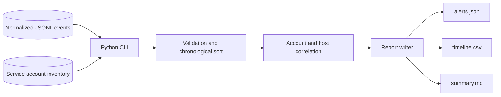
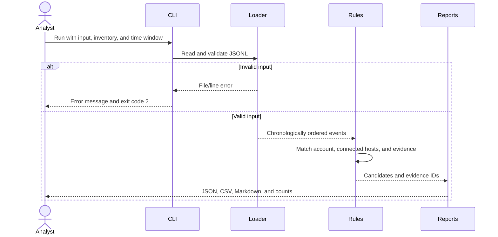

# Lateral Movement Hunt

**Trace a Windows account across hosts and turn scattered events into an evidence-linked investigation.**


[](LICENSE)
[](https://github.com/rohith-jpg/lateral-movement-hunt/actions/workflows/tests.yml)

> **Demo capture TODO:** save a genuine terminal screenshot at `docs/images/demo.png`. Show `python -m lateral_hunt`, the counts, and the generated summary with `PC-01 → PC-02 → FILE-01`. [Capture instructions](docs/images/README.md). No fabricated screenshot is included.

## Why this project

Windows authentication events are useful individually, but investigating movement between machines requires connecting accounts, source hosts, sessions, and execution evidence. This project demonstrates that workflow in a reproducible SOC exercise with an auditable Python implementation.

**All included evidence is synthetic.** The fixture produces **14 events and 2 alerts for one scenario**, not measured production performance. No real attack, deployed lab, or containment is claimed. The project demonstrates SOC analysis, detection engineering, and Python testing skills.

## Key features

- Correlates same-account network and RDP logons across three distinct hosts within a configurable window.
- Requires intermediate-host PSEXESVC service and child-process evidence before emitting a chain candidate.
- Enriches RDP sessions with 4672 only when host, account, local logon ID, and time agree.
- Rejects malformed records and duplicate event identities with file and line context.
- Produces JSON alerts, a CSV timeline, and a Markdown analyst summary.
- Includes benign controls, deterministic fixtures, and core/CLI tests for misleading correlations.
- Documents ATT&CK mapping, Splunk templates, alternative explanations, and evidence gaps.

## Architecture



The application reads local files and writes local reports. It has no database, external API, network service, or AI dependency. Raw EVTX conversion is outside the current scope.



Each run is an offline batch operation. A valid run with no matches still writes an empty alert list and a timeline. See [architecture and tradeoffs](docs/architecture.md).

## Tech stack

| Layer | Tool | Why |
|---|---|---|
| Runtime | Python 3.10+ | Portable CLI with no third-party runtime dependencies |
| Input/output | JSONL, JSON, CSV, Markdown | Inspectable data and readable evidence references |
| Tests | unittest | Core and CLI checks without a framework dependency |
| Formatting/lint | Ruff 0.16.8 | One pinned tool for style and static checks |
| Packaging | setuptools 80.9.0 | Installable src package and CLI entry point |
| Automation | GitHub Actions, Docker | Repeatable checks and isolated execution |
| Hunting reference | Splunk SPL, MITRE ATT&CK | Query templates and behavioral context |

## Quick start

Prerequisites: Git and Python 3.10+. This private repository requires GitHub access. Run commands from the repository root so relative data paths resolve.

```bash
git clone https://github.com/rohith-jpg/lateral-movement-hunt.git
cd lateral-movement-hunt
python -m venv .venv
```

Activate on **Windows PowerShell**:

```powershell
.\.venv\Scripts\Activate.ps1
Copy-Item .env.example .env
```

Or on **macOS/Linux**:

```bash
source .venv/bin/activate
cp .env.example .env
```

Install and run:

```bash
python -m pip install -r requirements-dev.txt
python -m pip install --no-build-isolation -e .
python -m lateral_hunt
```

`.env.example` is intentionally comments only: no secrets or variables are required, and the CLI does not load `.env`. Configure behavior with flags. If PowerShell blocks activation, use `.venv\Scripts\python.exe` instead of `python` without changing execution policy.

Expected output:

```text
Analyzed 14 events; 2 alerts written to results
```

Open `results/summary.md` or [the committed example](examples/summary.md). For a dependency-free checkout demo, `python hunt.py` works without installation. After installation, `lateral-hunt --help` is also available.

**Docker alternative** (Docker required):

```bash
docker build -t lateral-movement-hunt .
docker run --rm lateral-movement-hunt
```

To retain reports without bind-mount permission differences:

```bash
docker run --name lateral-hunt-demo lateral-movement-hunt
docker cp lateral-hunt-demo:/app/results ./docker-results
docker rm lateral-hunt-demo
```

The container runs as a non-root user. A CI job builds/runs it; Docker was unavailable in the original local authoring environment.

## Usage example

One normalized JSONL record:

```json
{"event_uid":"E06","timestamp":"2026-10-08T10:11:00Z","host":"FILE-01","channel":"Security","event_id":4624,"account":"LAB\\svc-backup","source_host":"PC-02","logon_type":10,"logon_id":"0x201","synthetic":true}
```

```bash
python -m lateral_hunt --input data/events.jsonl --service-accounts data/service_accounts.json --window-minutes 15 --output results
```

The complete fixture includes supporting evidence. An excerpt of its chain alert:

```json
{
  "rule": "psexec_then_rdp_candidate",
  "severity": "high",
  "account": "LAB\\svc-backup",
  "path": ["PC-01", "PC-02", "FILE-01"],
  "evidence": ["E02", "E03", "E04", "E05", "E06", "E07"],
  "attack": ["T1021.002", "T1021.001"]
}
```

One RDP record alone cannot produce the chain. The RDP alert and chain alert describe the same exercise, not two incidents.

**Limits:** temporal PsExec evidence is circumstantial; type 3 alone does not establish SMB; 4672 does not prove privilege escalation. Renamed services, unresolved hosts and missing telemetry cause misses. Concurrent administrators can cause false correlations. Read the [investigation](docs/hunt-report.md), [data contract](docs/data-contract.md), and [lab runbook](docs/lab-runbook.md).

## Project structure

```text
src/lateral_hunt/     # CLI, validation, correlation, output, shared types
 tests/              # Core and CLI integration tests
 data/               # Synthetic fixture and service-account inventory
 examples/           # Generated alerts, timeline, analyst summary
 detections/         # Splunk templates for the normalized schema
 docs/               # Architecture, investigation, lab runbook, references
 docs/images/        # Genuine demo capture instructions and reserved path
 scripts/            # Deterministic sample-data generator
 .github/workflows/  # Lint, format, tests, fixture and Docker checks
 hunt.py             # Backward-compatible checkout launcher
 pyproject.toml      # Package metadata and Ruff configuration
 requirements*.txt   # Runtime declaration and pinned development tools
 Makefile            # Setup/run/test/lint/format/sample/Docker shortcuts
 Dockerfile          # Non-root offline runner
```

## Testing

After installation:

```bash
python -m ruff check .
python -m ruff format --check .
python -m unittest discover -s tests -v
```

Or `make check` with GNU Make. `make format` formats Python files. Tests cover expected evidence, benign controls, missing prerequisites, host/account/channel mismatches, time boundaries, session scope, invalid JSON/types, CLI errors and empty input. CI targets Python 3.10 and 3.14; the badge reports actual GitHub status.

## Roadmap / future improvements

- [ ] Capture a genuine CLI demo at `docs/images/demo.png` using the [checklist](docs/images/README.md).
- [ ] Execute the isolated Windows lab and document authentic, redacted evidence.
- [ ] Validate Splunk templates on a live SIEM; they are currently unexecuted templates.
- [ ] Add an EVTX adapter with explicit field mapping and provenance.
- [ ] Evaluate labeled real telemetry before claiming detection quality metrics.
- [ ] Benchmark larger inputs before making performance claims; matching currently uses nested scans.
- [ ] Confirm author name and add LinkedIn/portfolio URLs.

No deployment URL is needed for an offline CLI. A hosted UI would be a separate optional extension. [Repository settings and pinned blurb](docs/portfolio.md) are suggestions for the owner to apply.

## Author

[rohith-jpg](https://github.com/rohith-jpg) · LinkedIn: **TODO — provide URL** · Portfolio: **TODO — provide URL**

[MIT license](LICENSE). Concept inspired by the user-provided myfirsthack brief; code, data and report are original. Reference screenshots are not redistributed. [Primary technical references](docs/references.md).
