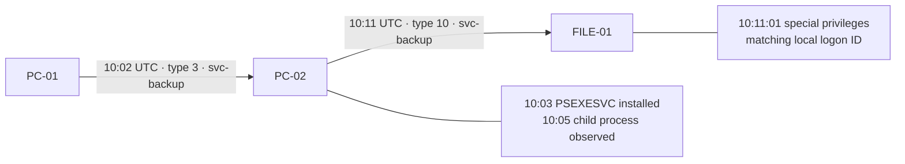

# Lateral Movement Hunt

An offline SOC investigation of **PC-01 → PC-02 → FILE-01**, combining Windows logons, service installation, and process creation to identify a PsExec-to-RDP candidate involving a service account.

**Evidence status:** all included events are synthetic. This repository demonstrates a reproducible analysis workflow; it does not claim that a Windows lab was deployed, a real compromise occurred, or containment was performed. SIEM queries are templates and have not been executed against a live SIEM.



## Run in one minute

Requires Python 3.10 or newer. No external Python dependencies or administrator rights.

```console
python hunt.py
python -m unittest discover -s tests -v
```

Expected: **14 events, 2 alerts**: one service-account RDP alert and one correlated two-hop candidate. These refer to the same scenario, not two separate incidents. Open `results/summary.md`, `results/timeline.csv`, and `results/alerts.json`. A checked-in example is in [examples](examples/summary.md).

```console
python scripts/generate_sample.py
python hunt.py --input data/events.jsonl --window-minutes 15 --output results
```

## Investigation and engineering

| Deliverable | Purpose |
|---|---|
| [Hunt report](docs/hunt-report.md) | Hypothesis, evidence, verdict, response recommendations |
| [Lab runbook](docs/lab-runbook.md) | Isolated Windows lab and log collection checklist |
| [Data contract](docs/data-contract.md) | Normalization and correlation semantics |
| [Splunk queries](detections/hunts.spl) | Account timeline and candidate detection templates |
| [Tests](tests/test_hunt.py) | Positive and negative correlation checks |
| [References](docs/references.md) | Microsoft and MITRE primary sources |

The detector requires a domain-qualified service account from an explicit inventory. It correlates type 3 and type 10 logons within 15 minutes, verifies the second source is the first destination, and looks for PSEXESVC installation plus a child process on the intermediate host. A 4672 event enriches the result only when account, host, local logon ID and time match.

## Interpretation limits

- Type 3 covers network access and is common in legitimate administration. Type 10 denotes RemoteInteractive logon. Neither establishes malicious intent.
- 4672 indicates special privileges assigned to a logon; it does not show a new group membership or prove privilege escalation.
- System event 7045 can record the service's execution account, which is not necessarily the installing operator. LocalSystem process activity is not automatically attributed to the remote account.
- Intermediate service/process correlation is temporal. Concurrent administrators can create misleading combinations. Confirm with original records, session identifiers, process GUIDs, network telemetry, approved changes, and interviews.
- This focused example misses renamed PsExec services, other remote execution tools, unresolved source hosts, incomplete telemetry, and activity outside the configured window. It is not a general lateral-movement detector.
- No Windows host, domain, SIEM, firewall, or account is modified by the Python scripts.

## Portfolio description

“Built a reproducible Windows lateral-movement hunting project using synthetic Security, System and Sysmon telemetry. Implemented account and host correlation, tested negative controls, mapped evidence to ATT&CK, and documented triage and telemetry limitations.”

The concept was inspired by the user-provided myfirsthack lateral-movement project screenshots. Code, sample data and report are original; screenshots are not redistributed.
