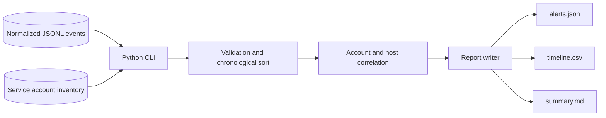
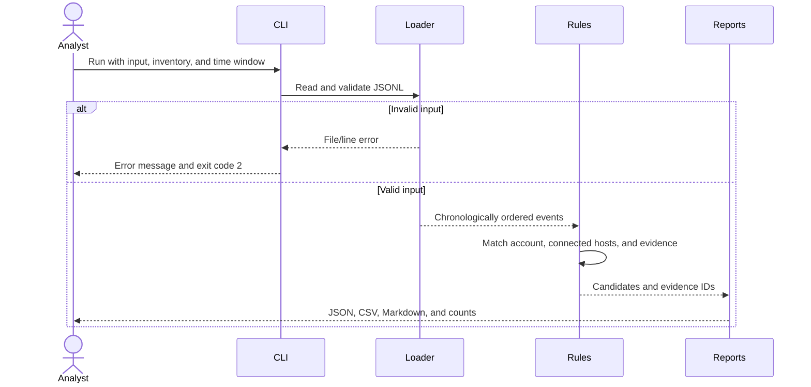

# Architecture

## System components

All processing is local; files are the only data stores. There is no API, database, frontend, or AI agent. Splunk searches are separate reference artifacts, not an integrated runtime dependency.

## Main data flow

Known field types and event identities are validated before correlation. A valid run with no matches still writes an empty alert list and the full timeline.

## Module boundaries

| Module | Responsibility |
|---|---|
| cli.py | Flags, account inventory, orchestration, actionable errors |
| io.py | Normalized event validation, timestamps, reports |
| core.py | In-memory correlation without filesystem/network side effects |
| models.py | JSON boundary aliases with flexible event-specific fields |
| __main__.py | Module entry point |

The root `hunt.py` intentionally supports an uninstalled checkout without duplicating detection logic. Installed entry points are `lateral-hunt` and `python -m lateral_hunt`.

## Decisions and limits

A chain requires an inventory-listed account, type 3 followed by type 10, three distinct connected hosts, and intermediate PSEXESVC installation plus child-process evidence in the time window. Identifiers are compared case-insensitively, without assuming aliases. Special-privilege enrichment requires matching host, account, local logon ID and time.

Service/process timing is circumstantial, not conclusive operator attribution. The implementation does not prove a process GUID link from the remote account to LocalSystem execution. Raw-data normalization, renamed-service detection, approved-change context and indexing remain future work.

Input is loaded into memory and matching uses nested scans; worst-case work can grow cubically with event count. This is a small-fixture teaching implementation, not a benchmarked streaming detector. Limit investigation windows and benchmark before scaling.

Flags configure input, inventory, output and window. No secrets or runtime environment variables are needed; `.env.example` records that fact. Docker runs the same module as a non-root user with no listening port. One process does not need Compose.
